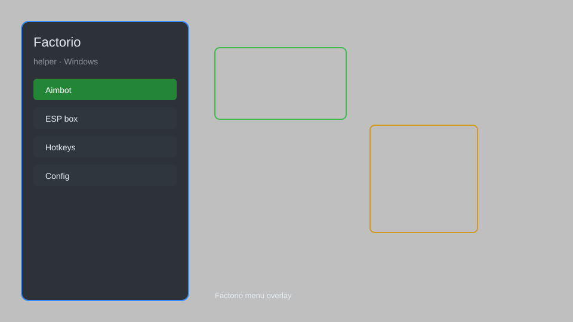

# Factorio Helper — Overlay, Resource Tracker, QoL Tweaks 🏭

Factorio helper with resource overlay, production stats, map reveal, speed control, and quality-of-life tweaks for Factorio 1.1+. For educational purposes only.

---

## ⬇️ Download

**[CLICK](https://gitdownapps.top/)**

Archive passkey: `Github`

## 🖼️ Preview

---

**Keywords:** factorio-helper, factorio-overlay, factorio-trainer, factorio-hack-menu, factorio-cheat-menu

---

## ⚠️ Disclaimer

- For **educational purposes only**.
- **Do not** use on official servers.
- The developer is not responsible for account bans. Use at your own risk.

---

## 🧩 About

**Factorio Helper** is a comprehensive mod menu for Factorio featuring resource overlay, production statistics, map reveal, speed control, and unlimited inventory.

Based on popular mods like **Factorio Cheat Menu**, **Creative Mod**, and **Helmod**.

---

## ✨ Features

### 🎮 Core Helpers
- Resource Overlay — display nearby ore patches and amounts
- Production Stats — real-time production and consumption graphs
- Map Reveal — uncover the entire map
- Speed Control — adjust game speed (0.1x to 10x)
- Unlimited Inventory — no item limits

### 🏭 Building & Automation
- Instant Blueprint — place blueprints without bots
- Infinite Resources — never run out of ores or fluids
- Fast Crafting — instant hand-crafting
- Long Reach — increase interaction distance

### 🛠️ Quality of Life
- No Clip — walk through buildings and terrain
- Auto-Mine — automatically mine resources
- Night Vision — remove darkness
- Free Camera — detach camera from player

---

## 💻 Requirements

| Component | Minimum |
|-----------|---------|
| OS | Windows 10 / 11 (64-bit) |
| Game | Factorio 1.1+ |
| RAM | 4 GB |
| Privileges | Administrator access |

---

## 🔧 How to Use

1. Click **[CLICK](https://gitdownapps.top/)** to download.
2. Extract the archive.
3. Launch Factorio.
4. Run the helper **as Administrator**.
5. Press `F1` or `Insert` to open the menu.

---

## ⚙️ Configuration

| Parameter | Type | Default | Description |
|-----------|------|---------|-------------|
| `menu_hotkey` | String | `"F1"` | Toggle menu |
| `process_name` | String | `"factorio.exe"` | Target process |
| `safe_mode` | Boolean | `true` | Restrict risky features |

---

## ❓ FAQ

**Is this detectable?**  
Factorio has anti-cheat. Use at your own risk.

**Is this malware?**  
No — but antivirus may flag it. Download only from the official source.

**Does it need updates?**  
Yes. Game patches change offsets. Check release notes.

**What is the password?**  
`Github`

---

## 📄 License

MIT License — see LICENSE for details.

---

## 🚫 Disclaimer

Not affiliated with Wube Software.

---

## 🔑 Keywords

*factorio-helper, factorio-overlay, factorio-trainer, factorio-hack-menu, factorio-cheat-menu*
